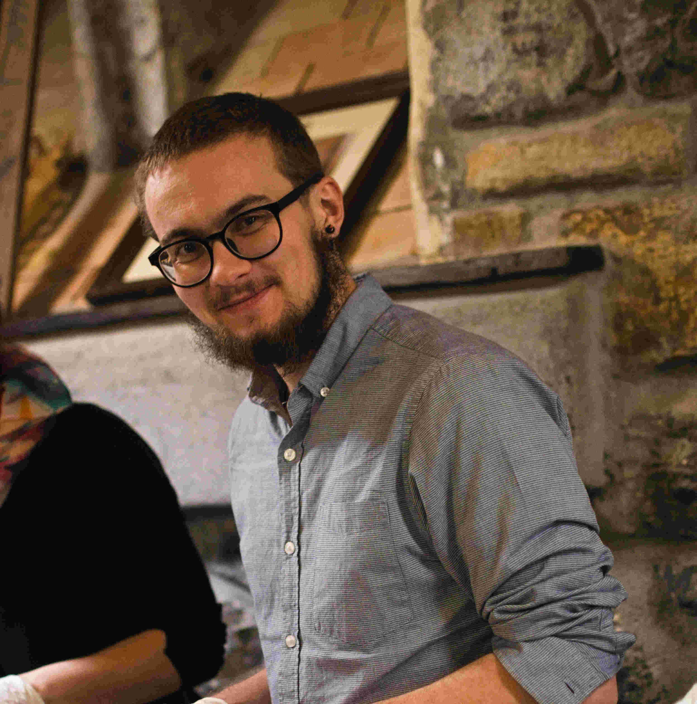

::: {.content-visible when-profile="english"}
Hi, I am Jakub Štenc

I am freshly finished PhD, currently looking for postdoc. I am interested in pollination, pollen transfer, floral ecology, pollinator behaviour and plant-pollinator interactions on the community level.

{fig-align="left" width="275"}
:::

::: {.content-visible when-profile="czech"}
Zdravím, jmenuji se Jakub Štenc

v roce 2024 jsem dokončil své doktorské studium a momentálně hledám postdoktorandskou pozici. Zabývám se opylováním, přenosem pylu, květní ekologií, chováním opylovačů a ve výsledku mě zajímá jak spolu dokáží rostliny a opylovači existovat v rámci společenstva.

{fig-align="left" width="275"}
:::
