#  {background-image="images/90985051_3160362750661404_9121786830419656704_o.jpg" style="text-align: center;"}

<head>

<body>

<h1 style="text-align:center;color:white;">

Opylovačské setkání II - slovo úvodem

</h1>

<h2 style="color:white;font-size: 30px;font-family: tahoma;text-align:center;">

::: {.absolute top="75%" left="50%"}
Jakub Štenc, Charles University, Czech Republic
:::

</h2>

{.absolute bottom="7%" left="0" width="250"}

{.absolute bottom="-2%" left="27%" width="184"}

</body>

</html>

## Program tohoto setkání

### 

::: {.nonincremental style="font-size: 19px"}
**Den první (sobota):**

-   11:00 - uvítání
-   11:30 - 12:30 - Historie, poslání, vývoj louky v čase (Zdeněk Janovský + Kuba Štenc)
-   12:30 - 14:00 - Pauza na oběd
-   14:00 - 14:45 - Depozice a přenos pylu, pylový GAUK - Petr Švanda + Martin Freudenfeld
-   15:00 - 15:45 - Věrnost a preference opylovačů aka vidle - Lucie Tomsová + Zdeněk Janovský
-   16:00 - 16:45 - Noční opylování - Tadeáš Ryšan + Terka Nencková
-   17:00 - 18:45 - Zvaná přednáška - Vojta Purnoch z Výzkumného ústavu včelařského
-   19:00 - 19:30 - Pizza
-   19:30 - volná zábava, masala

**Den druhý (neděle):**

-   10:00 - 10:45 - Sdílení opylovačů a síť depozic - Kuba Štenc
-   11:00 - 11:45 - Opylování na Americkém kontinentě - Hela Pijálková
-   12:00 - 12:45 - Výzkum trypanozóm v pestřenkách - Šimon Zeman
-   13:00 - 14:00 - Opylování čertkusu ve Slavkovském lese - Natalie Hanusová
-   14:00 - 15:00 - Rozloučení, balení etc.
:::

\

## O čem to bude

-   Co bylo - Handrkov, jak to celé začalo

-   Co je - momentálně řešíme

-   Co bude - plány na rok 2025 a dál

## Co bylo - dávno na Handrkově

---
fig-cap-location: top
---

```{=html}
<style>
 #slide1 .quarto-title-caption {
  font-size: 22px;
  }
</style>
```

<div>

:::: {.fragment fragment-index="1"}
::: {.absolute top="320" left="50"}
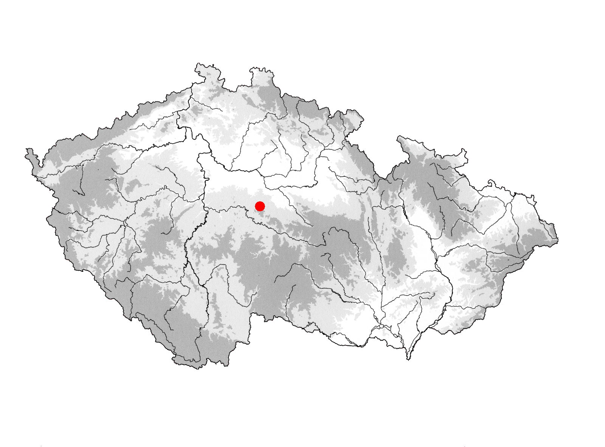{width="400"}
:::
::::

:::: {.fragment fragment-index="2"}
::: {.absolute top="50" right="-70"}
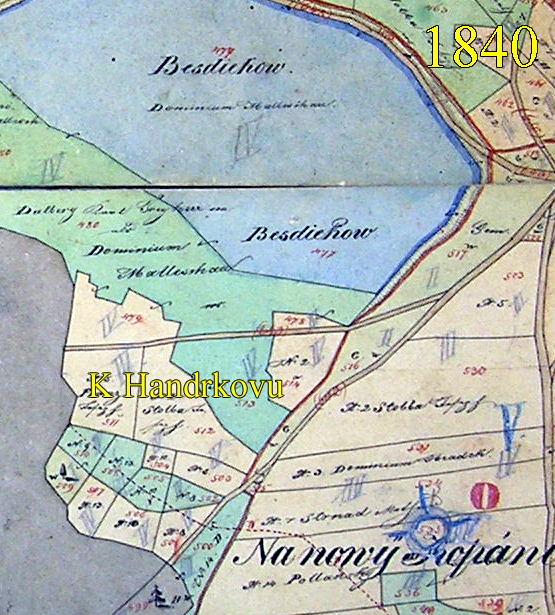
:::
::::

::: {.fragment .absolute top="250" left="-20"}
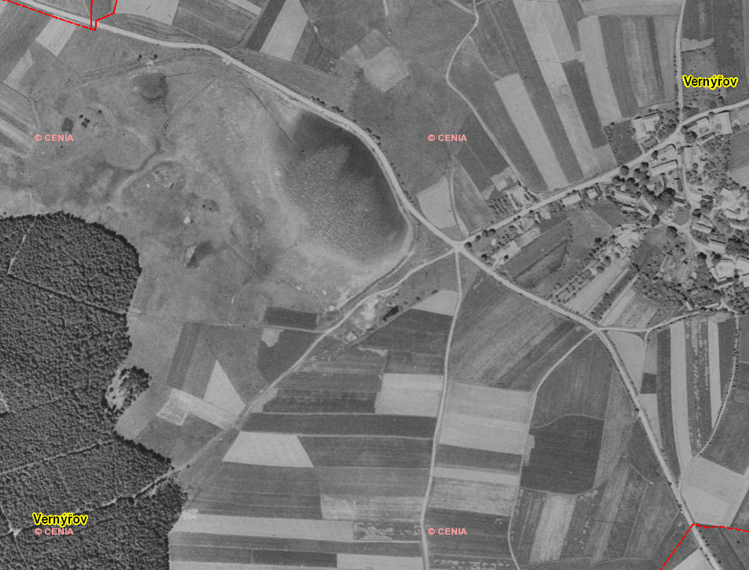{width="500"}
:::

</div>

::: {.incremental .absolute top="40" left="30" style="font-size: 14px"}
-   Původně malá políčka

-   Později snaha o zcelení a odvodnění

-   Vysoká diverzita
:::

## Co bylo - od roku 2011

::::: {layout="[0.6,  0.4]"}
::: fragment
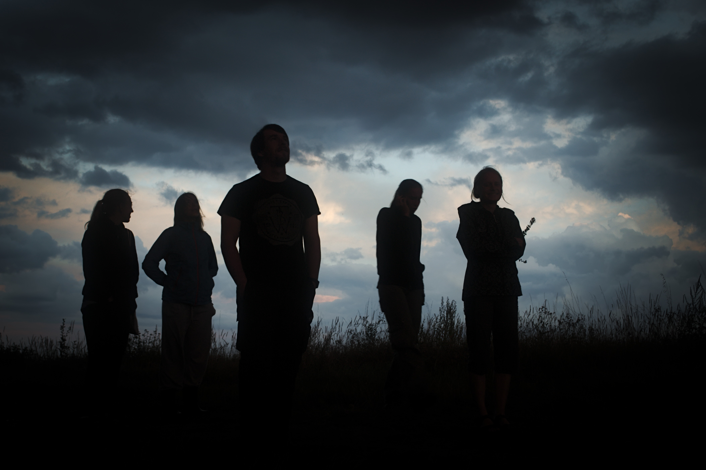
:::

::: {.incremental style="font-size: 14px"}
-   103 lidí od roku 2011
-   Loňský rekord 31 lidí na louce
-   14 let pokusu "Jiné čtverce"
:::
:::::

## Jiné čtverce

::: nonincremental
-   jiné čtverce
:::

---
fig-cap-location: top
---

```{=html}
<style>
 #slide1 .quarto-title-caption {
  font-size: 22px;
  }
</style>
```

<div>

:::::: {layout="[0.3,  0.3, 0.3]"}
::: {.fragment top="70" height="400"}
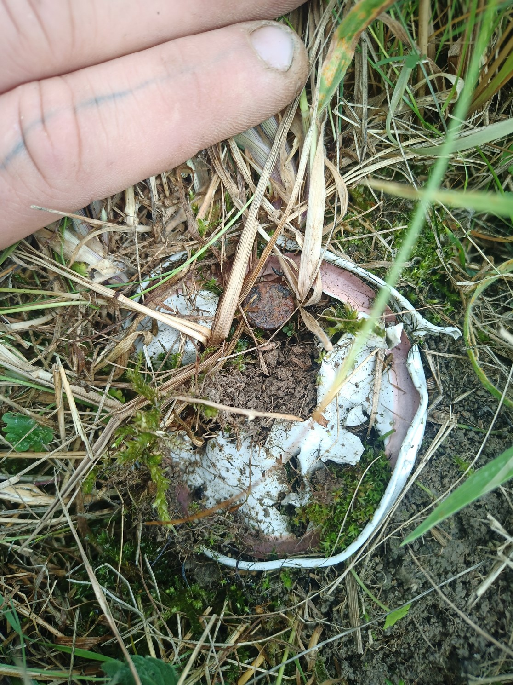
:::

::: {.fragment top="70" height="400"}
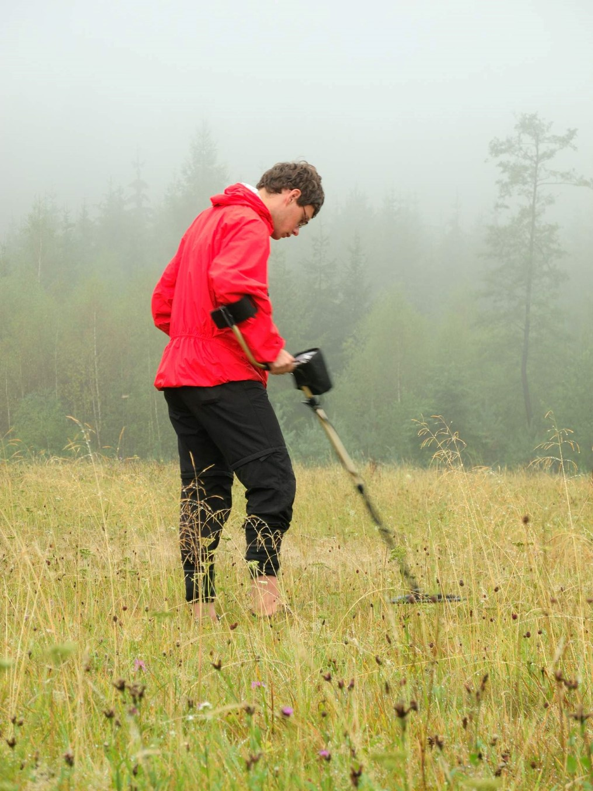
:::

::: {#sec-column .fragment top="70" height="700"}
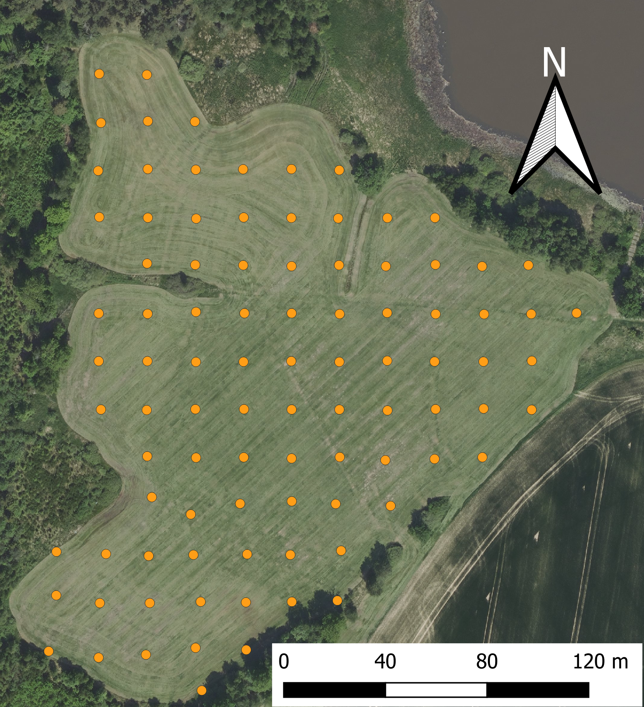
:::
::::::

</div>

## Jiné čtverce

<div>

::::: {layout="[0.5, 0.5]"}
::: {.fragment top="70" height="400"}
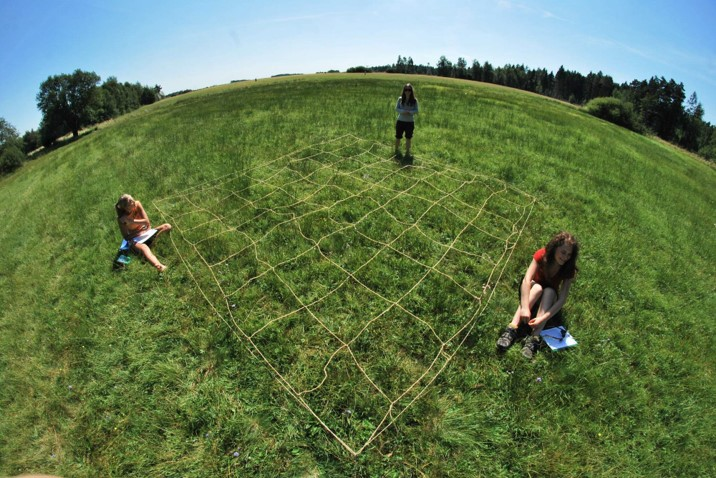
:::

::: {.fragment top="70" height="400"}
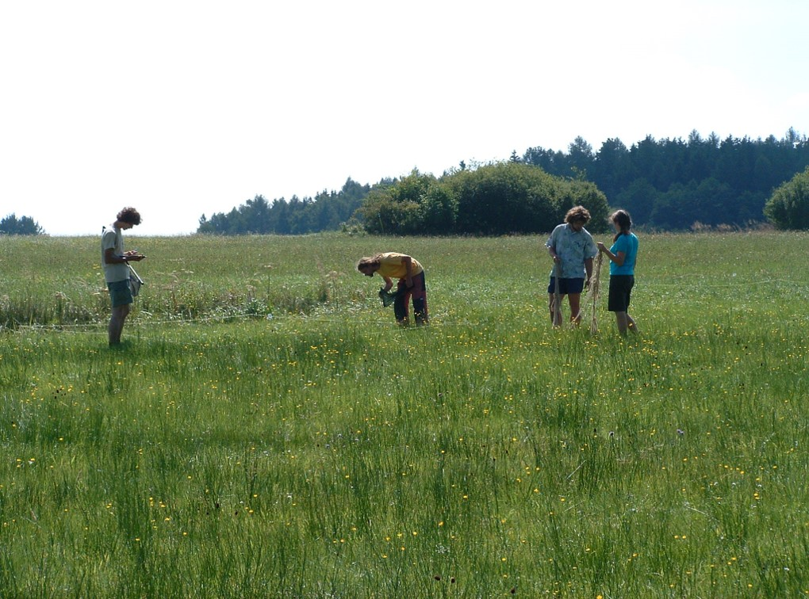
:::
:::::

</div>

## Jiné čtverce

<div>

::::: {layout="[0.5, 0.5]"}
::: {.fragment top="70" height="400"}
![[osnova]{style="font-size: 32px;"}](images/Picture1.jpg)
:::

<div>

<!-- empty column to create gap -->

</div>
:::::

</div>

::: {.absolute .fragment top="33%" left="55%"}
-   4 x 4 metrové čtverce
-   Kvetoucí lodyhy počítány v osnově
-   2krát každý rok
:::

## Obcházení

<div>

::::: {layout="[0.5, 0.5]"}
::: {.fragment top="70" height="400"}

:::

<div>

<!-- empty column to create gap -->

</div>
:::::

</div>

::: {.absolute .fragment top="33%" left="55%"}
-   "snímek" opylovačů na květech v daný čas
-   20 obejití každého čtverce za rok\
:::

## Jiné čtverce

Co vlastně jiné čtverce říkají o světe kolem nás?

<div>

```{r setup}
#| include: false
#-------------READ ME-----------####

   # This script serves to the first exploration and pre-analyses of the data from Handrkov 2011-2024
   # Log of possible problems, changes and comments etrc. can be found here: https://docs.google.com/document/d/1iAdDP0WE-Z7KCjPCh7StA5mAd4BrJD0UY1tZUGOXFSA/edit?tab=t.0


#-------------READ ME-----------#

# Packages #####

library(bipartite)
library("OpenImageR")
library("jpeg")
library(magick)
library(igraph)
library (iNEXT)
library("dplyr") 
library(tidyr)
#--------------#

# Colour definitions  ####
seda <- rgb(150,150,150, max = 255, alpha = 60, names = "blue")
modra <- rgb(104, 99, 219, max = 255, alpha = 80, names = "blue") #rgb(99, 155, 202)
zelena <- rgb(0, 158, 115, max = 255)
cervena <- rgb(220, 40, 100, max = 255)

#--------------#


# Data import ####
jine_ctverce_spojene_11_24 <- read.csv("data/jine_ctverce_spojene_11_24.csv")
net1124_edited<- jine_ctverce_spojene_11_24
#--------------#

# Unification of identificator ####
# This identificator is to identify one visit of the plot - thus it combines year, plot, month, day, hour, minute
net1124_edited$id_i<-as.character(net1124_edited$id_i)
net1124_edited$id_i<-with(net1124_edited,paste(rok,osnova,mesic*100+den,hod*100+min,sep="-"))
unique(net1124_edited$id_i)
#--------------#


net1124_edited$rok <- factor(net1124_edited$rok, levels = c("11", "12", "13", "14", "15", "16", "17", "18", "19", "20", "21", "22", "23", "24"))

# Standardization by sampling effort ####

## Data preparation before standardization for sampling effort ####
net1124_edited <-  net1124_edited[which(!net1124_edited$beh%in%c("Kratiny12_beh14","Kratiny12_beh12","Kratiny12_beh13","Kratiny12_beh11","Handrkov12_beh11", "Handrkov12_beh12", "Handrkov12_beh13")), ] # only Handrkov

## Standardization computation ####
# Standartization is computed by taking all the individual visits to the plot (coded by id_i) and the number of visits to the plot per year is obtained in following code

poc.obejiti <-  net1124_edited %>% group_by(id_i, rok, osnova) %>% summarize(count=n()) 
poc.obejiti$obejito <- 1    

obejiti <-  tapply(poc.obejiti$obejito, list(poc.obejiti$osnova, poc.obejiti$rok),sum, na.rm=T) 


obejiti2 <- obejiti 
obejiti2 <- data.frame(obejiti2[!rownames(obejiti2)%in%c(30, 31, 42,43,97),])
colnames(obejiti2) <- c(11:24)
obejiti2$osnova <- rownames(obejiti2) 
obejiti3 <- obejiti2 %>% pivot_longer(cols=c(colnames(obejiti2)[-15]),
                                      names_to=c('rok'),
                                      values_to='obejito')

### plot sampling effort #####
#pdf("Sampling_effort.pdf")
par(mfrow=c(1,1))
plot(tapply(obejiti3$obejito, list( obejiti3$rok), mean, na.rm=T), type="n", main="Sampling effort per year", ylab = "Average number of censuses per plot", xlab="Year",  col=rgb(0,0,0,0.25), axes = F, cex.lab=1.5, ylim= c(0,50))

lines(tapply(obejiti3$obejito, list( obejiti3$rok), mean, na.rm=T), lwd = 2)

axis(1, at=c(1:14), labels = c(2011:2024))
axis(2)
mean_plots <-tapply(obejiti3$obejito, list( obejiti3$rok), mean, na.rm=T)

sd_plots <-tapply(obejiti3$obejito, list( obejiti3$rok), sd, na.rm=T)

# Vertical arrow
arrows(x0=c(1:14), y0=mean_plots-sd_plots, x1=c(1:14), y1=mean_plots+sd_plots, code=3, angle=90, length=0.1, col="black", lwd=2)

#dev.off()
#--------------#


## Merge sampling effort with original table #####
net1124_edited <- merge( jine_ctverce_spojene_11_24,obejiti3, by = c("osnova", "rok"), all = TRUE)  # Use all=TRUE for a full outer join


# Data preparation #####
## data cleaning ####
net1124_edited <-  net1124_edited[which(!net1124_edited$osnova%in%c("L0","L1","L10","L11","L12","L2","L3","L4","L5","L6","L7","L8","L9")), ] # only plots in the meadow
net1124_edited <-  net1124_edited[!net1124_edited$druhK_opraveno%in%c("UNDETERMINED_trifolium","Epilobium_sp","Kanutia_arvensis","Leontodon_sp","nic","Hypericum_perforatum","Lycopus_europaeus","Galium_boreale","Galium_glaucum"), ] # only plots in the meadow
net1124_edited <-  net1124_edited[which(net1124_edited$opyluje%in%c("T","?" )), ] # only pollinators

## Plant corrections ####
net1124_edited[net1124_edited$druhK_opraveno%in% c("Cuscuta_sp") ,]$druhK_opraveno <- "Cuscuta_europaea"
net1124_edited[net1124_edited$druhK_opraveno%in% c("Myosotis_sp") ,]$druhK_opraveno <- "Myosotis_palustris"
net1124_edited[net1124_edited$druhK_opraveno%in% c("Stellaria_sp") ,]$druhK_opraveno <- "Stellaria_graminea"
net1124_edited[net1124_edited$druhK_opraveno%in% c("Lysimachia_sp") ,]$druhK_opraveno <- "Lysimachia_vulgaris"

net1124_edited <- droplevels(net1124_edited)


## new variable - number of observations corrected by smapling eefort per plot within a year
net1124_edited$corrected_number <- net1124_edited$pocet.x/net1124_edited$obejito

#--------------#

# General network data ####

net1124  <-   apply( tapply(net1124_edited$pocet.x, list(net1124_edited$rok, net1124_edited$osnova), sum)/tapply(net1124_edited$obejito, list(net1124_edited$rok, net1124_edited$osnova), unique), 1, sum, na.rm=T)


net1124 <- tapply(net1124_edited$corrected_number, list(net1124_edited$druhK_opraveno, net1124_edited$sitodruh), sum)

net1124[is.na(net1124)] <- 0

#--------------#


## Datasets per individual years ####

for (i in unique(net1124_edited$rok)) {
  
  # Create the data matrix for the current value of i
  net <- with(net1124_edited[net1124_edited$rok %in% c(i),], 
              tapply(corrected_number, list(druhK_opraveno, sitodruh), sum))
  net[is.na(net)] <- 0
  
  # Dynamically assign the matrix to a variable named "net<i>"
  assign(paste("net", i, sep = ""), net)
}

nets <- paste("net", unique(net1124_edited$rok), sep = "")


## Datasets per hour ####

for (i in unique(net1124_edited$hod)) {
  
  # Create the data matrix for the current value of i
  net <- with(net1124_edited[net1124_edited$hod %in% c(i)&net1124_edited$rok=="21",], 
              tapply(corrected_number, list(druhK_opraveno, sitodruh), sum))
  net[is.na(net)] <- 0
  
  # Dynamically assign the matrix to a variable named "net<i>"
  assign(paste("net_hod_", i, sep = ""), net)
}

nets <- paste("net_hod_", unique(net1124_edited$hod), sep = "")


```

::: {.absolute .fragment top="10%" left="10%" width="2000"}
```{r}
# do this just once
par(oma=c(0,0,0,0), mar=c(0,0,0,0),bg="transparent")
plotweb(
  net1124, 
  method = "normal", 
  text.rot = 90, 
  labsize = 0.000000000000001, 
  ybig = 0.8, 
  low.y = 0.6, 
  high.y = 0.98, 
  plot.axes = FALSE, 
  y.width.low = 0.05, 
  y.width.high = 0.05, 
  low.spacing = 0.01, 
  high.spacing = 0.01, 
  arrow="up",
  bor.col.low = zelena, 
  col.low = zelena, 
  col.high = cervena, 
  bor.col.high = cervena, 
  bor.col.interaction = modra, 
  col.interaction = modra
)
```
:::

</div>

::: {.absolute .fragment top="64%" left="50%"}
Rostliny
:::

::: {.absolute .fragment top="28%" left="50%"}
Opylovači
:::

::: {.absolute .fragment top="75%" left="35%"}
-   Co to ale znamená pro přenos pylu?
:::

## Jiné čtverce

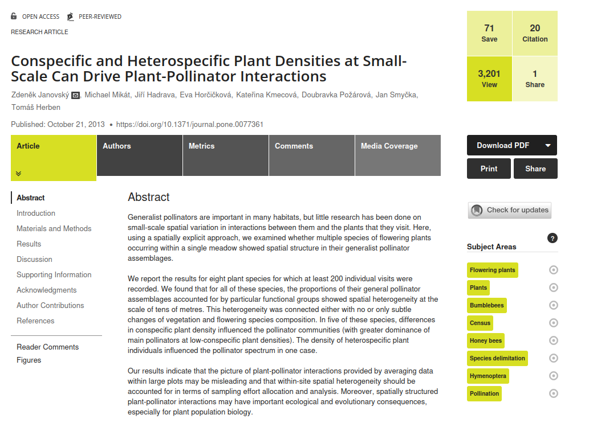

## Co je - co momentálně řešíme

::: incremental
-   Počítání 300 vzorků pylu z těl a střev zvířat chycených v průběhu dne

-   Produkce pylu (březen 2025)
 
-   První vzorky na depozici pylu 

-   Dočištění dat z jiných čtverců 
:::

## Co bude - plány do roku 2025

::: incremental
-   rok 15 jiných čtverců
:::

## Co bude - plány do roku 2025

::: nonincremental
-   rok 15 jiných čtverců - aplikace na sběr dat: <https://lycanea.shinyapps.io/myapp/>
:::

## Co bude - plány do roku 2025

::: nonincremental
-   rok 15 jiných čtverců

-   Síť založená na depozici pylu
:::

:::: {.fragment fragment-index="2"}
::: {.absolute top="50" right="-20"}
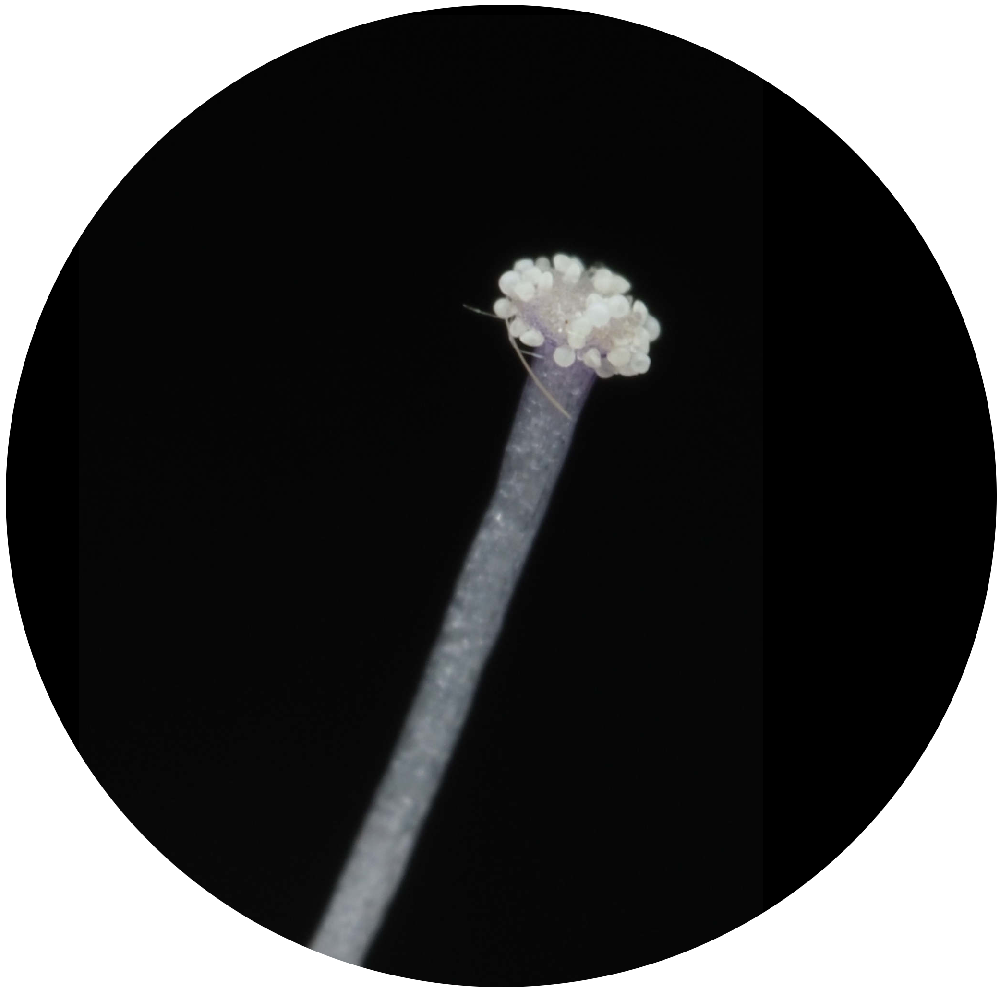{width="500"}
:::
::::

## Co bude - plány do roku 2025

::: nonincremental
-   rok 15 jiných čtverců

-   Síť založená na depozici pylu

-   Síť založená na stěrech a pylu ve střevech (PŠ+MF+EM)
:::

:::: {.fragment fragment-index="2"}
::: {.absolute top="50" right="-20"}
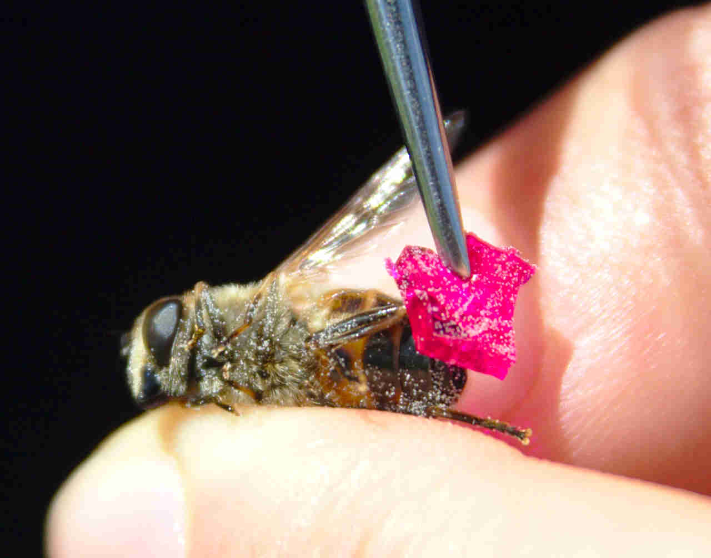{width="500"}
:::
::::


## Co bude - plány do roku 2025

::: nonincremental
-   rok 15 jiných čtverců

-   Síť založená na depozici pylu

-   Síť založená na stěrech a pylu ve střevech (PŠ+MF+EM)

-   Trypky - rok druhý (Šimon Zeman)
:::

:::: {.fragment fragment-index="2"}
::: {.absolute top="50" right="-80"}
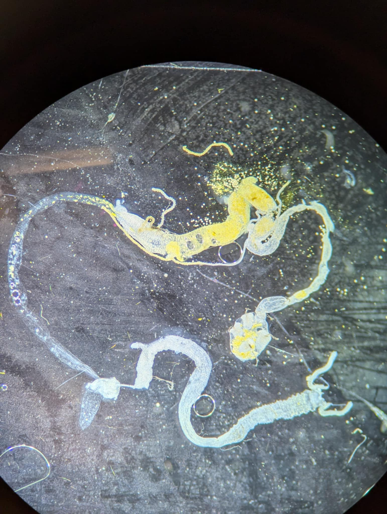{width="400"}
:::
::::

## Co bude - plány do roku 2025

::: nonincremental
-   rok 15 jiných čtverců

-   Síť založená na depozici pylu

-   Síť založená na stěrech a pylu ve střevech (PŠ+MF+EM)

-   Trypky - rok druhý (Šimon Zeman)

-   Nový systém na sběr dat o počasí
:::

:::: {.fragment fragment-index="2"}
::: {.absolute top="100" right="-80"}
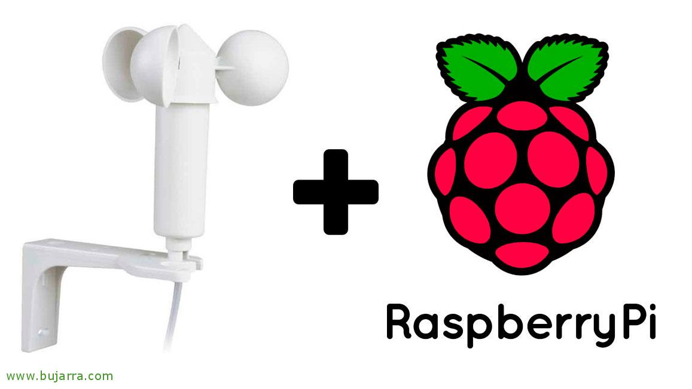{width="500"}
:::
::::

## Co bude - plány do roku 2025

::: nonincremental
-   rok 15 jiných čtverců

-   Síť založená na depozici pylu

-   Síť založená na stěrech a pylu ve střevech (PŠ+MF+EM)

-   Trypky - rok druhý (Šimon Zeman)

-   Nový systém na sběr dat o počasí

-   Data ohledně vlastností květů
:::


## Ostatní aktivity

-   Podcast

::::: {layout="[0.3,  0.3, 0.3]"}
::: {.fragment top="70" height="400"}
{width="300"}
:::

::: {.fragment top="70" height="400"}
{width="300"}
:::
:::::

## Ostatní aktivity

-   Komiks?

#  {background-image="images/90985051_3160362750661404_9121786830419656704_o.jpg" style="text-align: center;"}

<head>

<body>

<h1 style="text-align:center;color:white;">

Díky za pozornost!!!

</h1>

<h2 style="color:white;font-size: 30px;font-family: tahoma;text-align:center;">

::: {.absolute top="85%" left="40%"}
Jakub Štenc, Charles University, Czech Republic
:::

</h2>


</body>

</html>
