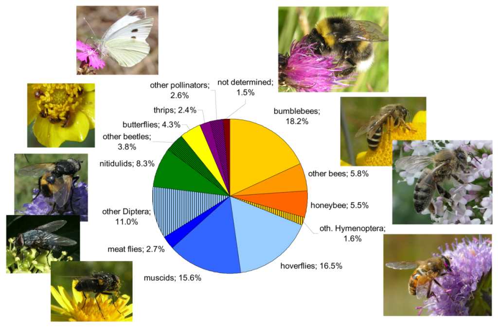
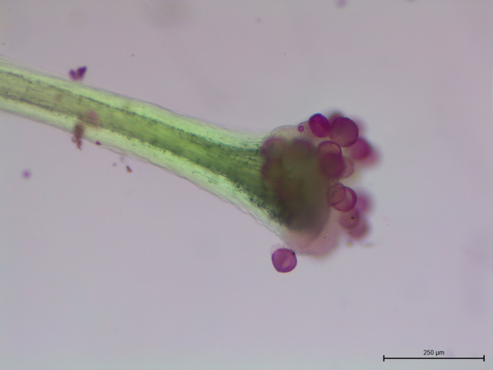
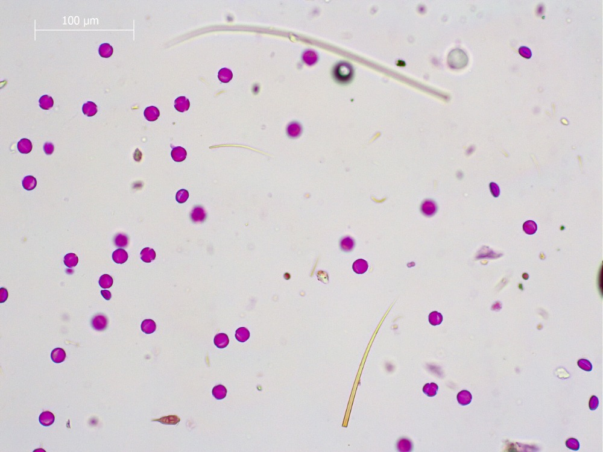
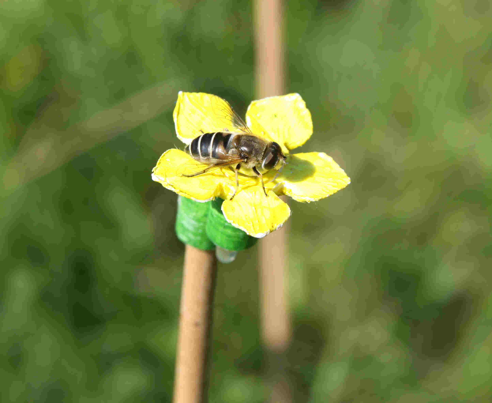

::: {.content-visible when-profile="english"}
# Research topics

## FLOVID: FLOwer VIsitor Database

Who are the pollinators of wild plants? What are the global patterns in plant-pollinator interactions? What does shape the composition of pollinator spectra?

That's principal questions which are surprisingly still largely unanswered. And I would like to answer them.

So far, we focused on

-   The majority of plants had either muscid-, hoverfly- or nitidulid-dominated or completely generalised pollinator spectra. Among such plants, higher local dominance increased the proportion of opportune muscids in pollinator spectrum, while hoverflies showed the opposite pattern. Honeybees although rather infrequent in pollinator spectra also showed a strong preference for locally dominant plant species.

-   *Synthesis*: The composition of a plant's pollinator spectrum is not independent of other aspects of the plant's life history, namely niche width and the ability to dominate the community. Wider plant species niches result in more generalised pollinator spectra, supporting our hypothesis that habitat generalists are less prone to specialisation on particular pollinator groups. Conversely, the ability to dominate local plant communities influenced pollinator spectra mainly through specific responses of individual pollinator groups.

If you are interested, you can find more in following publication:

Janovský, Z., & Štenc, J. (2023). Pollinator community and generalisation of pollinator spectra changes with plant niche width and local dominance. Functional Ecology, 00, 1--10. <https://doi.org/10.1111/1365-2435.14439>

_na_bezu_cehbdi2.jpg)

## Pollen transfer

## Pollinator sharing among plants

Currently, the following topics for bachelor's and master's thesis are available:

-   [The mechanisms affecting heterospecific pollen transfer and the influence on long-term plant co-existence](https://is.cuni.cz/studium/dipl_st/index.php?id=&tid=&do=main&doo=detail&did=279151)

-   [The effect of floral traits on pollinator sharing between plants](https://is.cuni.cz/studium/dipl_st/index.php?id=&tid=&do=main&doo=detail&did=279151)

## Pollinator behaviour

Currently, the following topics for bachelor's and master's thesis are available:

-   [Factors affecting pollinator behaviour in relation to pollen transfer](https://is.cuni.cz/studium/dipl_st/index.php?id=&tid=&do=main&doo=detail&did=279279)

:::

::: {.content-visible when-profile="czech"}
# Témata výzkumu

## FLOVID: Databáze návštěvníků květů

_na_bezu_cehbdi2.jpg)

## Přenos pylu

V rámci tohoto tématu je možné zpracovávat bakalářskou a diplomovou práci pod mým vedením. Vypsaná témata najdete na této stránce.

## Sdílení opylovačů rostlinami

V rámci tohoto tématu je možné zpracovávat bakalářskou a diplomovou práci pod mým vedením.

## Chování opylovačů

V rámci tohoto tématu je možné zpracovávat bakalářskou a diplomovou práci pod mým vedením.
:::
